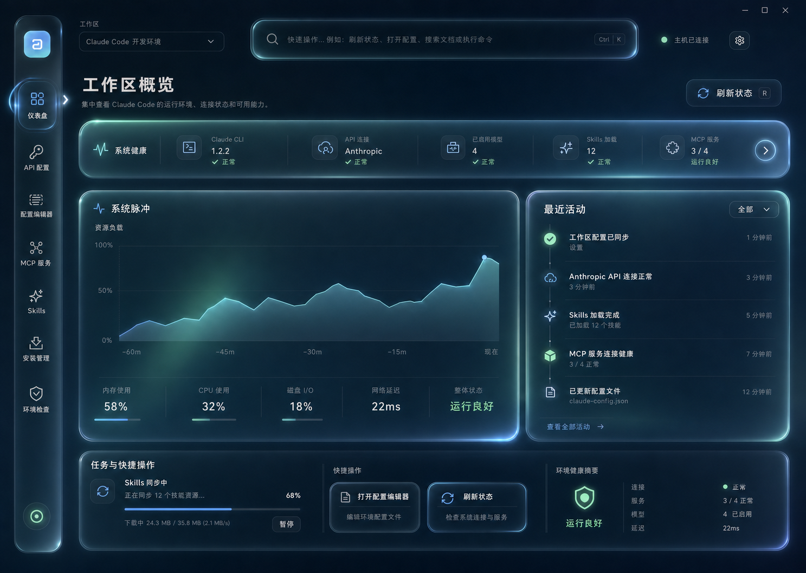

# Claude Console 全量 Liquid Glass React UI 重设计

## 目标

将 Claude Console 的仪表盘、API 配置、配置编辑器、MCP 服务、Skills、安装管理和环境检查全部迁移到统一的 React + WebView2 界面。保留现有 .NET 服务、ViewModel、凭据存储和配置文件格式作为业务事实来源，不在 TypeScript 中复制业务规则。

重设计以 `rdev/liquid-glass-react` 的边缘折射、光学高光、轻微色散和弹性反馈为材质基础。界面必须在高效果模式下具有清晰可见的液态玻璃特征，同时保证文字、表单和代码内容不被折射或模糊影响。

## 已批准的视觉目标

视觉方向采用“沉浸空间工作台”：

- 左侧为窄型液态图标坞，激活项通过形变、高光和折射光晕表达状态。
- 顶部包含工作区切换、全局命令入口、主机连接状态和页面主操作。
- 主内容使用横向系统健康带、主要任务面和右侧上下文时间线构成稳定的信息层级。
- 主工作区下方使用“任务与快捷操作”底栏填满可用空间，承载后台任务进度、两个上下文操作和环境摘要。
- 深色基底使用午夜蓝、冰蓝和薄荷绿环境光。玻璃层级不超过三层，不使用卡片套卡片。

## 范围

### 本次包含

- React 壳层、七个完整页面、页面内对话框与抽屉。
- 所有现有查看、编辑、保存、测试、安装、卸载、刷新和导航工作流。
- 全局任务底栏、命令入口、主题同步、加载/空/错误/成功状态。
- 键盘导航、可见焦点、紧凑窗口响应式布局和减少动效模式。
- WebView2 不可用或 Web 资源加载失败时的原生 WPF 安全回退。

### 本次不包含

- 改变 Claude Code 配置格式、凭据存储方式或服务端协议。
- 引入云同步、账户体系或新的远程数据源。
- 用虚构业务数据填充界面。
- 移除原生 WPF 回退；迁移完成后它只作为故障恢复路径存在。

## 应用结构

### React 层

- `AppShell`：窗口环境光、布局断点、主题和全局错误边界。
- `NavigationDock`：七个页面入口、激活形变、键盘导航和紧凑状态。
- `WorkspaceCommandBar`：工作区选择、命令搜索、主机状态和页面主操作。
- `PageRouter`：在 WebView 内切换页面，保持每页必要的草稿和滚动状态。
- `TaskShelf`：显示安装、同步、检测和连接测试等后台任务，并提供上下文快捷操作。
- `GlassSurface`：将 `liquid-glass-react` 封装为少量受控预设，并把折射层与清晰内容层分离。
- `MotionProvider`：统一动效时长、缓动、减少动效和低性能降级策略。
- `bridge`：强类型请求、响应和主机推送事件；页面不直接访问 `window.chrome.webview`。

### .NET 主机层

现有 ViewModel 和 Service 继续负责业务逻辑。`WebUiBridge` 扩展为按页面划分的快照与命令处理器：

- 读取命令返回可序列化快照。
- 写入命令调用现有 ViewModel 命令或 Service，不复制校验和持久化逻辑。
- 长任务先返回已接受状态，再通过主机事件推送进度、结果或错误。
- 主题、更新通知和外部文件变更由主机主动推送。

原生页面在正常运行时不参与导航；只有 WebView2 初始化失败、静态资源缺失或用户显式进入故障恢复时才显示。

## 数据流

1. React 发送带 `id`、`type` 和可选 `payload` 的请求。
2. .NET 桥验证消息和载荷，将命令路由到对应 ViewModel/Service。
3. 主机返回带 `ok`、`data` 或结构化 `error` 的响应。
4. 长任务通过 `task.started`、`task.progress`、`task.completed` 和 `task.failed` 事件更新任务底栏。
5. 页面只在成功响应后提交本地表单状态；失败时保留用户输入并显示可恢复错误。

桥接命令按领域分组，例如 `api.get`、`api.save`、`api.test`、`config.get`、`config.save`、`mcp.list`、`mcp.test`、`skills.search`、`skills.install`、`installer.run` 和 `environment.check`。每个命令都有对应的 TypeScript 类型和 xUnit 协议测试。

## 页面设计

### 仪表盘

- 横向健康带显示 Claude CLI、API、模型、Skills 和 MCP 的真实状态。
- “系统脉冲”使用当前会话内的真实健康快照绘制趋势，不新增持久化遥测。健康值由已安装、已连接、已启用和活动服务等现有状态派生。
- 右侧时间线显示配置同步、连接测试、技能操作和环境检查等真实事件。
- 底栏显示一个进行中的后台任务、两个上下文快捷操作和环境健康摘要。没有任务时保留稳定高度并显示最近完成结果。

### API 配置

- 主任务面包含提供商选择、端点、模型和高级配置。
- 右侧上下文面显示凭据状态、连接测试结果和可用模型。
- API 密钥始终使用密码输入和主机凭据存储；React 不持久化密钥。
- 保存、测试连接和检测模型映射到现有命令，并在任务底栏显示进度。

### 配置编辑器

- 左侧文件导航、中央代码编辑器、右侧文件信息与冲突处理面板。
- 保留外部修改检测、保存冲突、备份写入和文件切换前的未保存提示。
- 代码区使用清晰不折射的实色内容层；玻璃只用于壳、工具栏和面板边缘。

### MCP 服务

- 主任务面为可搜索的服务器列表，使用轻量行分隔而非独立玻璃卡片。
- 右侧抽屉完成添加、编辑、重命名、删除和连接测试。
- 连接状态和测试输出通过主机事件实时更新，不阻塞页面导航。

### Skills

- 保留“已安装”和“市场”两种数据视图、搜索、刷新、安装和卸载。
- 列表以高密度行和详情面板呈现，安装进度进入全局任务底栏。
- GitHub URL 识别、镜像重试和离线回退继续由现有服务负责。

### 安装管理

- 一个主状态面显示 Claude Code CLI 版本、安装渠道和可用操作。
- 实时日志放在清晰的终端内容层，安装/卸载进度同步到任务底栏。
- 失败状态保留日志、错误摘要和安全重试入口。

### 环境检查

- Node.js、npm 和 Git 使用单一分组列表，显示版本、路径、状态和修复动作。
- 检查过程逐项更新；下载入口继续由主机打开可信外部地址。
- 环境健康摘要复用到仪表盘底栏，避免两套计算逻辑。

## 液态玻璃系统

`GlassSurface` 提供四个预设：

- `navigation`：图标坞和激活导航，较明显的位移与弹性。
- `prominent`：健康带、主要任务面和对话框，强调边缘折射但保持内部清晰。
- `interactive`：按钮、切换项和可点击行，悬停与按压时短暂增强高光和形变。
- `subtle`：工具栏、底栏和被动分组，低位移、低色散。

折射效果作为绝对定位的材质层存在，内容渲染在独立清晰层中。长列表、代码编辑器、日志和滚动内容不直接使用动态折射。屏幕上同时动态计算的高成本玻璃面保持在少量固定区域，其余区域使用共享 CSS 玻璃样式。

## 动效与交互

- 导航悬停：约 140ms 的边缘高光增强和轻微横向吸附。
- 导航激活：约 240ms 的液态外扩、回弹和共享高光移动。
- 按钮按下：约 90ms 的压缩，释放后约 180ms 回弹；不移动文字基线。
- 页面切换：约 260ms 的共享主任务面形变与内容淡入，不使用整页滑飞。
- 图表刷新：约 420ms 的向上揭示；数值变化使用短促插值。
- 活动时间线：首屏使用 35ms 间隔的轻量交错进入，后续更新只动画新增行。
- 任务底栏：任务开始时在约 220ms 内展开，完成后保持结果，用户离开或确认后收回。
- 主题切换：环境光与表面颜色交叉淡化，避免白色闪屏。

`prefers-reduced-motion`、主机减少动效设置或低效果策略启用时，移除位移、回弹、交错和图表揭示，仅保留不超过 120ms 的透明度变化与清晰焦点状态。

## 响应式行为

- 宽屏：图标坞、主任务面、右侧上下文面和任务底栏全部显示。
- 中等窗口：右侧上下文面缩窄，次要说明隐藏，任务底栏保持单行。
- 紧凑窗口：上下文面变为可展开抽屉，健康带横向滚动，图标坞保持可用。
- 最小支持窗口为 820×640；低于该尺寸时优先保证当前任务和主操作，不缩小正文到不可读尺寸。

## 可访问性

- 所有图标按钮都有可访问名称和工具提示。
- 交互目标至少等效 44px，键盘焦点不依赖玻璃高光表达。
- 正文与状态文字满足可读对比，成功/警告/错误不只依赖颜色。
- 对话框管理焦点圈定与关闭后焦点恢复。
- 加载、刷新和长任务使用 `aria-live` 的简洁状态文本。

## 错误与恢复

- 页面读取失败显示局部错误面和重试，不让整个壳层崩溃。
- 保存或执行失败保留用户输入，并在对应字段或操作区显示原因。
- 桥接超时转为可重试错误；重复提交由命令状态和按钮禁用共同阻止。
- WebView2 或构建资源失败时自动回退到完整原生 WPF 界面。
- 配置冲突、删除和卸载继续使用明确确认，不用瞬时 toast 代替重要决策。

## 验证标准

- Vitest 覆盖路由、页面状态、表单校验、任务底栏、减少动效和桥接客户端。
- xUnit 覆盖所有新消息类型、快照映射、命令路由、错误返回和长任务事件。
- 每个领域至少有一个端到端成功路径和一个失败恢复路径。
- 在 1440×1024、1024×768 和 820×640 三个视口做截图比较，检查溢出、裁切、文字清晰度、圆角和间距。
- 对已批准视觉稿和实现截图进行同尺寸并排比较，至少迭代一次可见差异。
- 验证深色、浅色、减少动效、强制 CSS 玻璃回退和 WebView2 故障回退。
- 完整 `npm test`、`npm run typecheck`、`npm run build`、`.NET` 测试和 Release 构建必须通过。

## 完成条件

- 七个页面的现有核心工作流均可在 React 界面完成，不再正常跳转到原生页面。
- 已批准视觉稿中的壳层、健康带、主任务面、时间线和任务底栏均落地。
- 动效在正常模式下清晰但克制，在减少动效模式下完整降级。
- 没有虚构状态、不可用主操作、被折射影响的正文或无法键盘完成的核心流程。
- WebView2 故障不会阻止用户继续使用 Claude Console。
